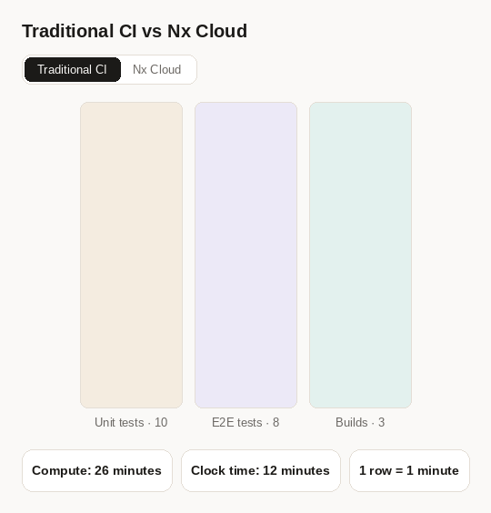
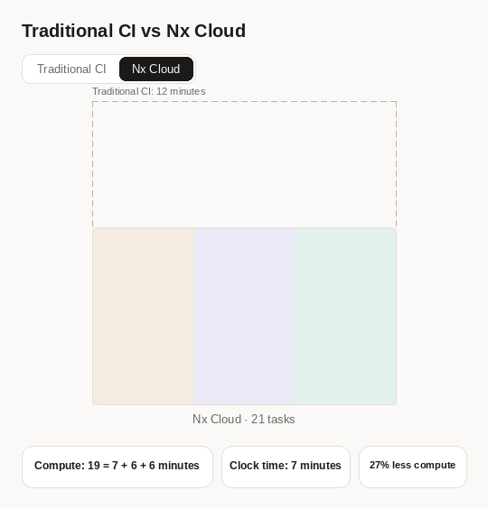

# Benchmark: Nx Cloud Platform vs Nx Using Remote Cache Only

Recent changes to the Nx Cloud platform significantly increase the cache hit rate and
reduce compute, while also making CI much faster. This benchmark demonstrates the impact
and explains where the savings come from.

Across a realistic mix of pull requests, the platform verifies changes **9.2x faster** and
uses **2.1x less compute** than the same workspace running on remote cache alone.

## The workspace

The repository is a synthetic but realistically shaped monorepo.

|                                   | Count |
| --------------------------------- | ----- |
| Projects                          | 511   |
| Feature libraries                 | 302   |
| UI libraries                      | 130   |
| Utility libraries                 | 70    |
| Applications and support projects | 9     |

## The tasks

A full CI run executes 1,634 tasks.

| Target        | Tasks | Notes                                                    |
| ------------- | ----- | -------------------------------------------------------- |
| typecheck     | 510   | one per library                                          |
| lint          | 510   | one per library                                          |
| test          | 507   | Vitest, one per library                                  |
| e2e-ci slices | 100   | one Playwright spec per task                             |
| build         | 3     | only the two applications and the products package build |
| validate      | 1     | simulates a CI check that is not project specific        |

Some tasks have to run in a particular order:

- Applications must be built before e2e tests can run, because the tests exercise the
  built artifacts through a preview server.
- Typechecks run in dependency order so they do not consume extra CPU and RAM.
- E2E tests have to run one at a time, simulating a shared resource they all need.

Note that real repositories often have many more dependencies between tasks, for example
many buildable libraries. Nx Cloud does even better in those cases, because it freely moves
tasks between agents to get optimal performance.

Everything is supposed to represent a mid-size monorepo used to build an application or a platform.

## The three scenarios

Every measurement below covers the same three types of change:

- **Full rebuild** — a global change, so every task in the graph reruns.
- **Large change** — a shared UI library changes, invalidating a large slice of the graph.
- **Feature change** — a single feature library changes (a typical pull request).

Two numbers are reported for each. **Verification time** is the wall-clock time a
developer waits. **Verification compute** is the total machine time consumed across every VM or agent,
which is what the run actually costs.

## Baseline: remote cache only

[nrwl/cache-dte-bench](https://github.com/nrwl/cache-dte-bench) is the same repository
using only remote caching, without Nx agents, Nx Ultracache or distributed task execution. This baseline
has the same performance characteristics as a DIY caching solution, and it uses
one VM per task type: build, typecheck, lint, test, e2e and validate.

| Scenario       | Verification time | Verification compute |
| -------------- | ----------------- | -------------------- |
| Full rebuild   | 58m 22s           | 1h 59m 42s           |
| Large change   | 44m 59s           | 1h 15m 52s           |
| Feature change | 45m 10s           | 49m 53s              |

## Nx Cloud

| Scenario       | Verification time | Verification compute | vs baseline                    |
| -------------- | ----------------- | -------------------- | ------------------------------ |
| Full rebuild   | 14m 0s            | 1h 27m 34s           | 4.2x faster, 27% less compute  |
| Large change   | 7m 39s            | 44m 26s              | 5.9x faster, 41% less compute  |
| Feature change | 4m 4s             | 21m 22s              | 11.1x faster, 57% less compute |

Compute is the main job plus its six agents. A typical feature pull request is verified in
about four minutes.

## Total compute

The overall saving depends on how often each kind of change occurs, and that ratio differs
between repositories. This comparison assumes 80% of CI executions are feature changes,
17% are large changes, and 3% are full rebuilds.

| Weighted average     | Baseline | Nx Cloud |
| -------------------- | -------- | -------- |
| Verification time    | 45m 32s  | 4m 58s   |
| Verification compute | 56m 24s  | 27m 16s  |

That is **9.2x faster** verification using **2.1x less compute** (a 52% reduction).

It is certainly possible to make the DIY solution faster, but doing so costs more compute.
It's also very hard to optimize the Feature Change scenario in the DIY case to come anywhere
near 4m 4s.

## How did we achieve this?

Two core mechanisms produce these savings:

- Ultracache
- Task distribution with dynamic compute packing

**Ultracache.** Nx Cloud instruments CI executions to learn what each task reads and
writes, down to every single file. That is far more precise than a conservative declaration
of everything a task might read. Combined with splitting tests into individual targets, it
makes each test independently cacheable, which drastically lowers p80. Another benefit is
that the cache configuration is always correct. Ultracache is a more advanced version of the
cache and requires Nx Cloud's task distribution.

**Task distribution with dynamic packing.** Nx Cloud learns how long each task takes and
what its CPU and RAM profile is. It understands critical paths and schedules work to
minimize wall-clock time. For instance, it can start the e2e tests that have to run one at a
time, then pack the rest of the VM with other tasks.

The core intuition is that you pay for VM minutes, not for how hard the VM works. As a
result, most CI executions either have low average CPU and RAM usage, often 20% of
capacity, or they run into out-of-memory errors and CPU throttling. That is what happens
when you set the parallelism flag by hand. You experiment with it until performance is
decent and CI is stable. As workspace evolve those settings often become outdated
and got lowered.

With Nx Cloud you set nothing. It knows what tasks run in what order, which tasks
can coexist on the same agent, and how much each one consumes, so it assigns work
dynamically to keep VMs near capacity, which means fewer VM minutes.

This is a viz illustrating traditional CI vs Nx Cloud:

Nx Cloud:

You can see the task allocation across all agents during a full rebuild:

You can see the number of concurrent tasks changes based on capacity, and in the very end it's reduced to six,
because we have leftover e2e tests we need to finish, and we have nothing to pack.

## What if my workspace is messy?

Both mechanisms, and the rest of Nx Cloud, help more in messy real world workspaces than in
a clean benchmark. In a real workspace your tasks have messy dependencies, so your manual
cache configuration tends to be a lot more conservative, while Ultracache always picks up
exactly what you need.

A real workspace also has many more dependencies between tasks, and those tasks have very
different CPU and RAM profiles. So your parallelism setting has to account for the largest tasks in the set,
which can easily consume 10x more RAM or CPU.

No matter how messy tasks are, Nx Cloud partitions them into
smaller units, runs them in the right order, and packs VMs to their limits.
So the parallelism changes dynamically.

Because this benchmark is artificial and uniform (to make it easier to understand),
that messiness is not there, so the baseline performs better here than it would in practice.

## Blacksmith numbers

The pull requests in the baseline benchmark also ran on Blacksmith. A faster runner helps,
but only where the work is CPU bound. The full rebuild drops from 58m 22s to 46m 37s, while
the feature change barely moves, because its wall-clock time is dominated by an e2e VM that
spends most of its time on IO.

Nx Cloud against Blacksmith:

| Scenario       | Blacksmith           | Nx Cloud            | Difference                     |
| -------------- | -------------------- | ------------------- | ------------------------------ |
| Full rebuild   | 46m 37s / 1h 38m 46s | 14m 0s / 1h 27m 34s | 3.3x faster, 11% less compute  |
| Large change   | 43m 28s / 1h 6m 25s  | 7m 39s / 44m 26s    | 5.7x faster, 33% less compute  |
| Feature change | 43m 29s / 47m 8s     | 4m 4s / 21m 22s     | 10.7x faster, 55% less compute |

Each cell is verification time followed by compute. Weighted by the same 80/17/3 mix:

| Weighted average  | Blacksmith | Nx Cloud |
| ----------------- | ---------- | -------- |
| Verification time | 43m 34s    | 4m 58s   |
| Compute           | 51m 58s    | 27m 16s  |

Nx Cloud is 8.8x faster than Blacksmith using 1.9x less compute.

Note that both Blacksmith and Nx Cloud (both self-serve price and especially enterprise price) sell cheaper VM minutes so whatever savings you see vs GHA are a lot more drastic.
